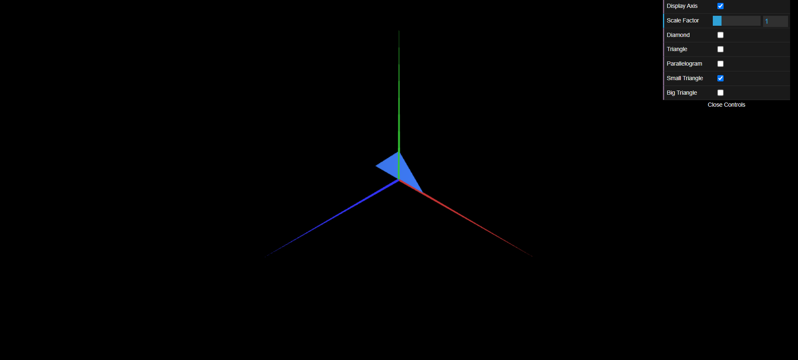
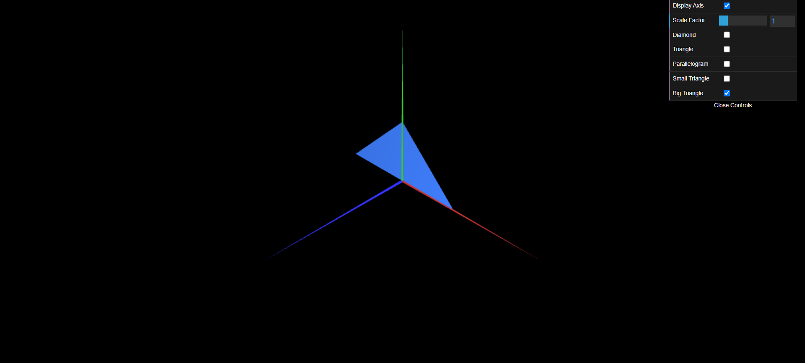

# CG 2023/2024

## Group T11G08

## TP 1 Notes

- No priemeiro exercício, tendo como base o ficheiro `MyDiamond.js`, já fornecido, criamos o ficheiro `MyTriangle.js`, formado apenas com um triângulo. Para além disso, criamos também um ficheiro  `MyParallelogram.js` que, sendo *double-size*, foi constituído por oito triângulos, quatro no *front side* e mais quatro no *back side*. Para acabar este exercício, criamos uma *checkbox* que permite ativar e desativar a visualização das três figuras que temos.

- No segundo exercício, apenas tivemos de criar dois triângulos, `MyTriangleSmall.js` e `MyTriangleBig.js`, que foram criados no mesmo formato que o triângulo formado no exercício anterior.

