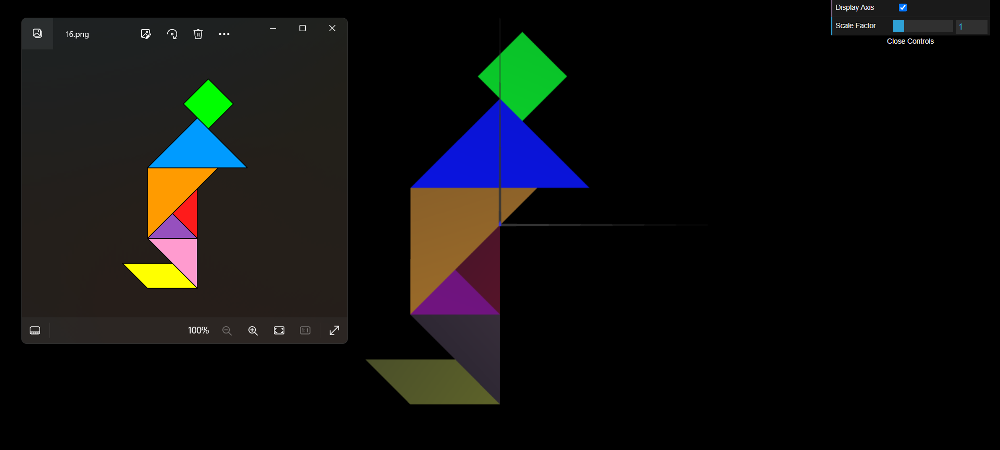
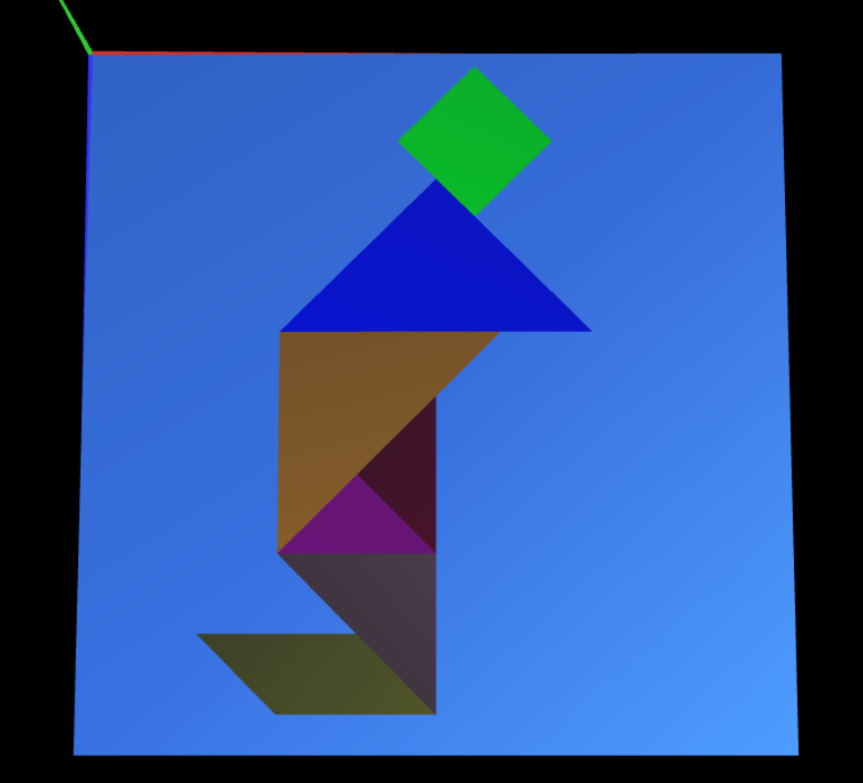
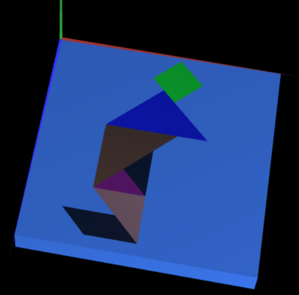

# CG 2023/2024

## Group T11G08

## TP 2 Notes

- No primeiro exercício, tendo como base os ficheiros criados durante a tp1, criamos um ficheiro `MyTangram.js` onde, com uma imagem dada, a sua função foi dar *display* às figuras de modo a que ficassem na mesma disposição que as mostradas na imagem. Para isso, tivemos de usar funções tais como *rotate*, *translate* e *scale* para transformar as figuras corretamente. A maior dificuldade que tivemos ao resolvê-lo foi encontrar as coordenadas certas para a translação correta de cada forma geométrica, uma vez que a maioria das peças eram triângulos, cujos lados envolviam raizes quadradas (não eram valores certos).

- No segundo exercício, criamos um cubo unitário centrado na origem. Este cubo foi contruído por uma malha composta por 12 triângulos, definindo assims as faces do cubo. Posteriormente juntamos a figura do exercício anterior com o cubo, posicionando-o atrás do Tangram. Por fim, aplicamos as transformações geométricas necessárias para posicionar o conjunto de forma paralela ao plano XZ. Para isso, utilizamos as funções *rotate* e *translate*. A maior dificuldade encontrada foi descobrir as distância exata para colocar o vértice superior esquerdo na origem (0, 0, 0).

- No terceiro exercício foi criado novamente um cubo unitário, no entanto desta vez criamos um quadrado e, a partir desse quadrado, construímos o cubo. Este exercício em comparação com o anterior mostrou ser mais complicado, uma vez que tivemos de aplicar transformações à figura ao invés de ligar os vértices, o que por vezes se tornou confuso.

