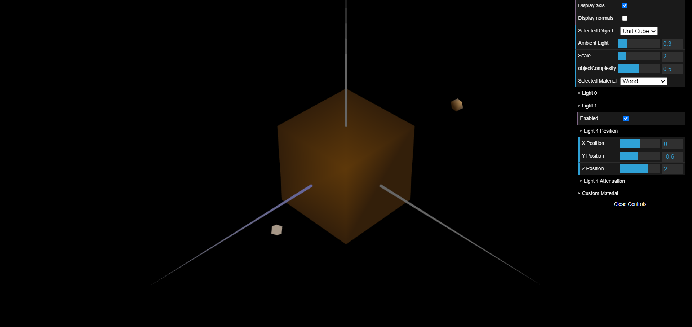
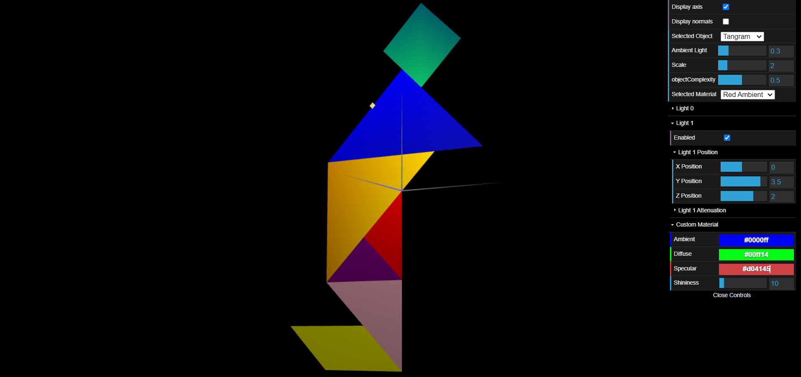
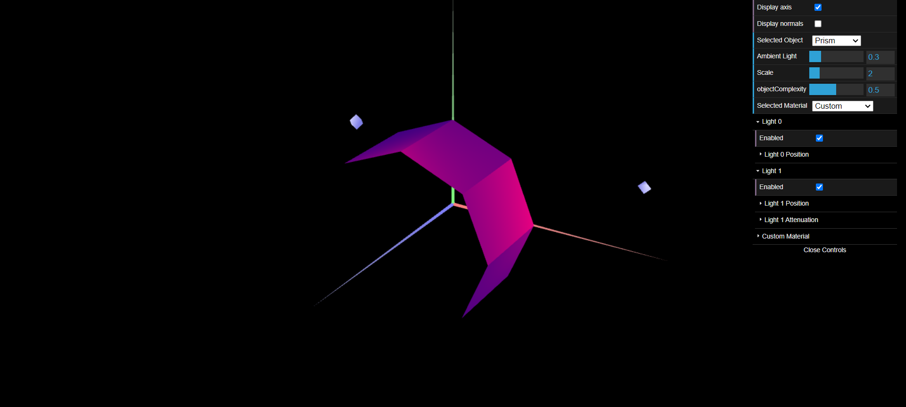
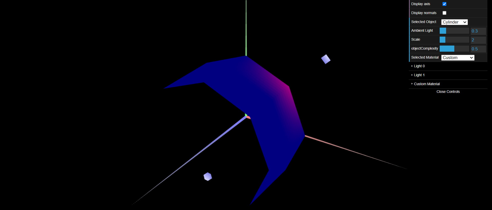

# CG 2023/2024

## Group T11G08

## TP 3 Notes

- No primeiro exercício, tendo em conta as figuras criadas na tp2, foram criadas as normais  de todas as figuras presentes na pasta tp3 e depois criamos um novo material semelhante a madeira com uma luz ambiente castanha e uma componente especular baixa.

- Numa segunda parte do mesmo exercício foi necessário criar um novo material para cada peça do `Tangram.js` com uma cor correspondente ao original e, para o `Diamond.js`, bastou aplicar o material *Custom*, já dado anteriormente. Todos estes materiais têm uma elevada componente especular.

- No segundo exercício  criámos uma nova forma, `MyPrism.js`, que se trata de um prisma com número de lados pode ser alterado. Assim como em *Constant Shading*, as normais em cada face são iguais, tornando assim a iluminação calculada semelhante à calculdada utilizando o conceito referido. A parte mais complicada neste exercício foi o cálculo dos vértices e, a implementação dos mesmos e, consequentemente, o cálculo das normais dos mesmos.

- No terceiro exercício criámos uma nova forma, `MyCylinder.js`, que se trata de um cilindro com número de lado que pode ser alterado. Em geral foi apenas fazer alguns ajustes ao código da classe `MyPrism` para obter o cilindro. A parte mais complicada neste exercício foi eliminar os vértices duplicados.

