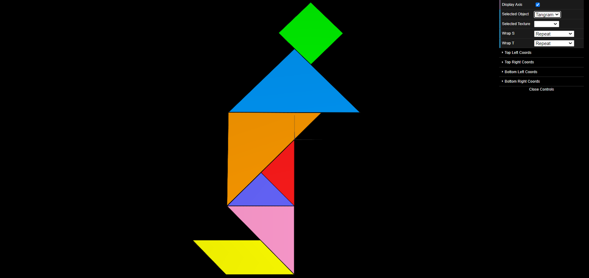
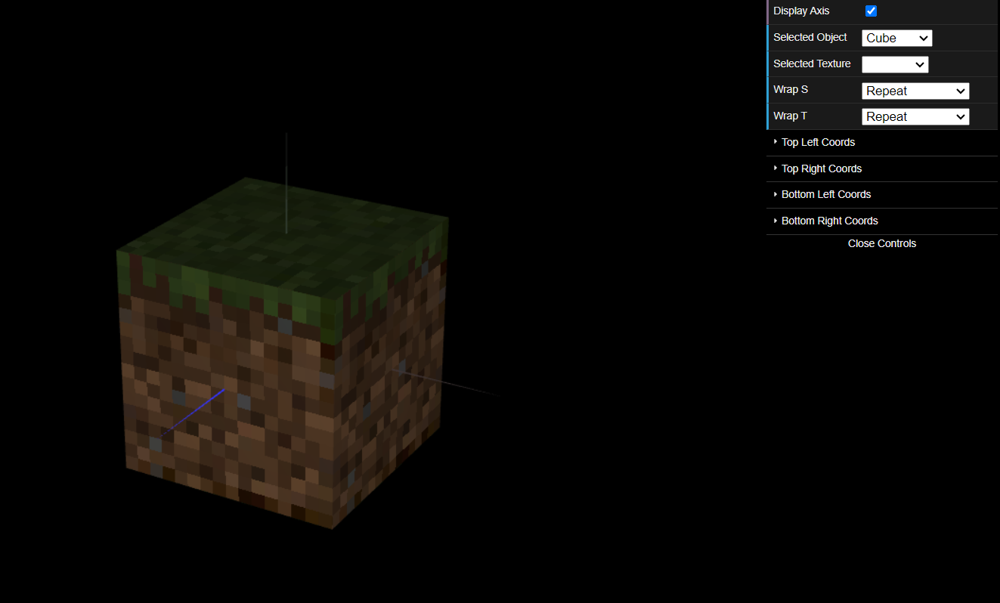

# CG 2023/2024

## Group T11G08

## TP 4 Notes

- No primeiro exercício foi-nos pedido para criar um `Tangram.js`, tendo em conta o *tangram* criado anteriormente no entanto, desta vez, criamos uma textura através da imagem `tangram.png` e associamos a cada forma do *tangram* as correspondentes coordenadas da textura da imagem.

- No segundo exercício foi-nos pedido para colocar textura em todos os quadrados do cubo da classe `MyUnitCubeQuad` de modo a ficar igual ao icónico cubo do Minecraft. A parte mais complicada foi descobrir como alterar o tipo de filtragem de uma textura.

