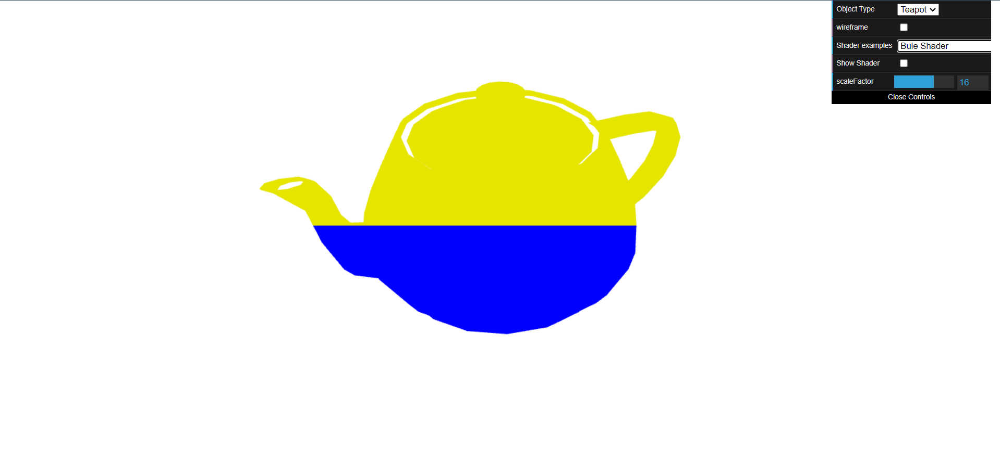
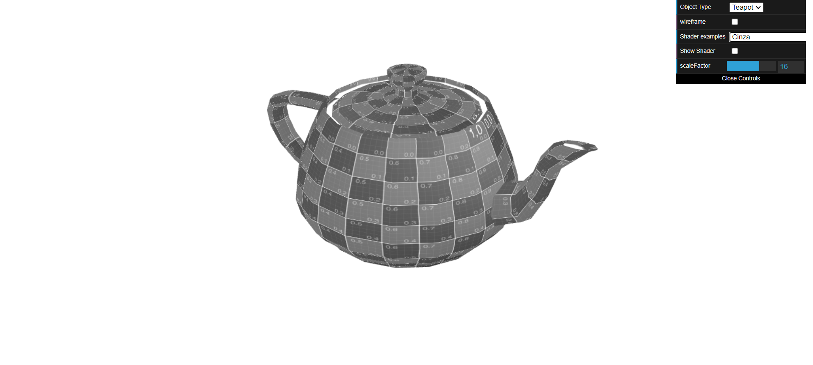
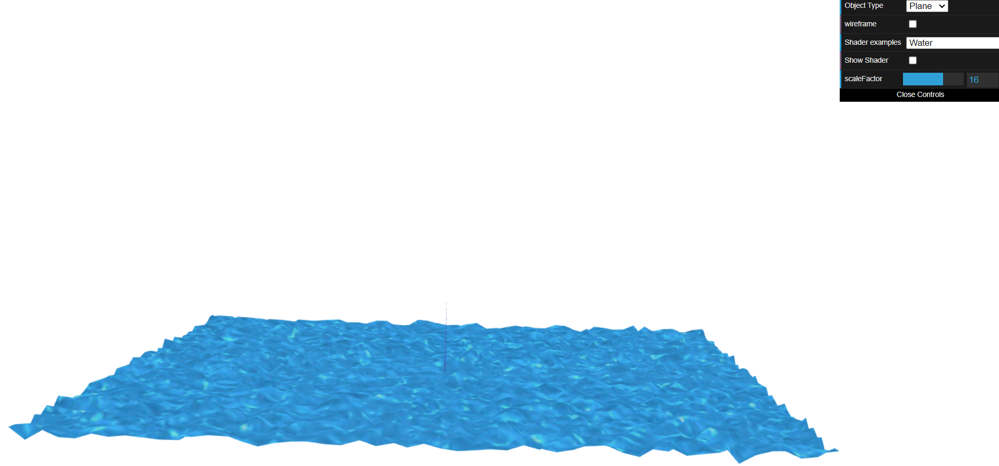

# CG 2023/2024

## Group T11G08

## TP 5 Notes

- No primeiro exercício foi nos pedido para criar um novo shader `buleshader`, com os respetivos vertex e fragment shaders. Este divide o objeto `Teapot` nas cores amarelo e azul. Para as coordenadas y > 0.5 o bule fica amarelo e para o inverso fica azul.

- Ainda no primeiro exercício, de seguida, criamos uma animação onde o o bule segue o movimento de uma onde sinusoidal segundo o eixo XX. De seguida, criamos um novo shader `cinza` baseado no shader `sepia`, onde o bule ficou cinza.

- No segundo exercício aplicamos uma textura de água e, em seguida, animamos as coordenadas para que se assemelhassem às ondas da água. A parte mais complicada do exercício foi ajustar as coordenadas de forma a coincidir com o exemplo dado.

